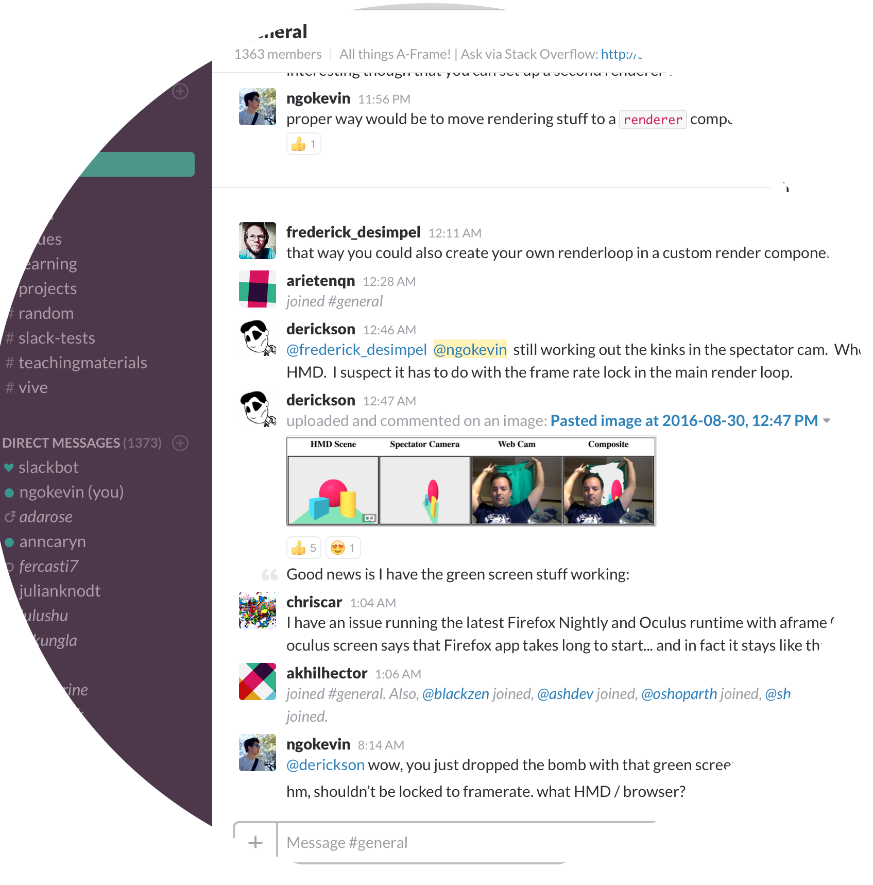

<!-- .slide: class="slide__title" data-background-video="media/video/aframe-logo.mp4" data-background-video-loop="true" data-state="state--bg-blue" -->

<div class="talk-title">
  <h1>A-Frame</h1>
  <h2>Building VR on the Web</h2>
</div>

Ron Dagdag @rondagdag <BR>  March 9, 2017  <BR> Dallas MVP Mix 2017  <!-- .element: class="talk-info" -->

------

<!-- .slide: class="slide__questions"   style="background-color: rgba(20, 20, 20, 0.1)" -->

# Audience Survey

- Web Developers?
- UX Designers?
- VR Developers?
- IoT/Robotics Engineers?

<!-- NOTES -->
- who is my Audience

---

<!-- .slide: class="slide__questions"   style="background-color: rgba(20, 20, 20, 0.1)" -->

# Introduction 

Ron Dagdag
@rondagdag

- Microsoft MVP
- 3D Developer at Thyssenkrupp Elevator
- Hackster DFW Ambassador  [meetup.com/Hackster-DFW](https://meetup.com/Hackster-DFW)
- Dallas Littlebits Chapter Leader [meetup.com/amRobotics](https://meetup.com/amRobotics)
- Dallas AR/VR Development meetup [meetup.com/Dallas-Virtual-Reality](https://meetup.com/Dallas-Virtual-Reality)
- Hackster Projects [bit.ly/hackster-ron](https://bit.ly/hackster-ron)

<!-- NOTES -->
- who am i

---

# Hackster Portfolio  <!-- .element: style="color: #black" -->


<!-- NOTES -->
- hackster portfolio

---

# Microsoft Hololens Robot Demo <!-- .element: style="color: #black" -->

<iframe width="760" height="515" src="https://www.youtube.com/embed/R_YixHJsLU4" frameborder="0" allowfullscreen></iframe>

<!--<script src="//content.jwplatform.com/players/RbTpdNqW-83w7PVgg.js"></script>-->


<!-- NOTES -->
- microsoft build b15

------

# Virtual Reality  <!-- .element: data-autoslide="0" class="fragment fade-out" -->

<!-- .slide: data-autoslide="5000" data-background-video="media/video/virtualreality.mp4" data-background-video-loop="true" data-background-video-muted="true" data-state="state--bg-dark" -->

<!-- NOTES -->
- Technology that simulates physical presence in interactive and realistic 3D
  environments
- Next platform. From PCs -> Smartphones -> VR
- Change how we work + play + communicate digitally
- Digi-Capital forecasts $20B VR market by 2020, half Asia
- Tell your stories about VR (e.g., I hit someone on the head while playing Fruit Ninja)

---

# Fun!

<!-- .slide: data-background="media/img/vrshooting.jpg" data-state="state--bg-dark" -->

<!-- NOTES -->
- Tell interested stories about your experiences with VR.

---

## Hardware

<div class="image-row">
  <div></div>
  <div></div>
  <div></div>
</div>

<div class="image-row">
  <div></div>
  <div></div>
  <div></div>
</div>

<!-- NOTES -->
- Free to $899
- Tethered and untethered
- Smartphone, gaming consoles, and PCs
- Positional tracking vs. rotational only
- Controllers (3DoF vs. fully tracked) vs. headset only
- Inside-out vs. outside-in tracking systems
- **HTC Vive** currently the most compelling

---

## Friction of VR Ecosystems

<div class="captioned-image-row">
  <div>
    
    <i>Gatekeepers</i>
  </div>
  <div>
    
    <i>Installs</i>
  </div>
  <div>
    
    <i>Closed</i>
  </div>
</div>

<!-- NOTES -->
- App stores and corporations control distribution: can take down or block content
- Downloads / installs are a barrier to consumption: small business pages
- Closed ecosystem: proprietary engines, steep learning curves, siloed experiences, fragmentation
- We want VR to be successful, so we want a platform without these points of friction. The answer is WebVR...

------

# WebVR

An open virtual reality platform with the advantages of **the Web**

<div class="captioned-image-row">
  <div>
    
    <i>Open</i>
  </div>
  <div>
    
    <i>Connected</i>
  </div>
  <div>
    
    <i>Instant</i>
  </div>
</div>

<!-- NOTES -->
WebVR is...virtual reality in the browser, powered by the Internet

Open:
- Anyone can publish
- Open source culture with open standards

Connected:
- Traverse worlds

Instant:
- Click a link on Twitter or Weibo, immediate VR experiences
- No installs
- Imagine for long tail experiences: shopping & personal spaces
- Great for long tail bite-sized experiences

Transition:
- Web has advantages that make it the best platform for the people
- Need to act to make it reality, can't wait for VR to bake and crystallize
- Get involved

---


Standard browser APIs that enable WebGL rendering to headsets and access to VR
sensors
https://w3c.github.io/webvr/

<!-- NOTES -->
API:
- Optimized rendering path to headsets
- Access position and rotation (pose) data

History:
- Initial WebVR API by Mozilla
- Working W3C community group
- Mozilla, Google, Samsung, Microsoft, community currently iterating WebVR 1.0 API

Not just a specification, it's implemented...

---

<div class="captioned-image-row">
  <div>
    
    <i>Firefox Nightly</i>
  </div>
  <div>
    
    <i>Chromium (Experimental)</i>
  </div>
  <div>
    
    <i>Samsung Internet</i>
  </div>
  <div>
    
    <i>Mobile Polyfill</i>
  </div>
</div>

<!-- NOTES -->
- Firefox + Chrome WebVR 1.0 hits release channels by early 2017
- Currently behind Nightly, custom builds, and flags
- Mobile Polyfill: use device motion / orientation sensors to polyfill on smartphones
- With all the browsers behind it...

---

# Mixed Reality <!-- .element: style="color: #black" -->

<iframe width="760" height="515" src="https://www.youtube.com/embed/SqXo7pKJGtU" frameborder="0" allowfullscreen></iframe>

<!-- NOTES -->
- microsoft windows 10 creators update

---

<!-- .slide: data-background-video="media/video/roomscale.mp4" data-state="state--bg-dark" -->

## The Web is Ready for VR

<!-- NOTES -->
- The Web is capable of VR
- Walk in a web page, reach out with your hands
- https://webvr.rocks/

---

## Metaverse

<!-- .slide: data-background="media/img/metaverse.png" -->

<!-- NOTES -->
- Shared persistent collective virtual spaces
- Alternate digital reality that the world may live, work, play
- Must be decentralized/open/connected, the Web is best platform to fully realize
- Where do we begin?
- three.js abstracts WebGL, 3D, and WebVR, but could still make it more accessible
---


<!-- .slide: data-background-video="media/video/boilerplate.mp4" data-state="state--bg-dark" -->

<div class="slide__boilerplate">
  <p>Import WebVR polyfill</p>
  <p>Set up camera</p>
  <p>Set up lights</p>
  <p>Initialize scene</p>
  <p>Declare and pass canvas</p>
  <p>Listen to window resize</p>
  <p>Install VREffect</p>
  <p>Instantiate renderer</p>
  <p>Create render loop</p>
  <p>Preload assets</p>
  <p>Figure out responsiveness</p>
  <p>Deal with metatags and mobile</p>
</div>

<!-- NOTES -->
- Too difficult to create WebVR experiences
- Obstacle if doing small prototypes and experiments
- Boilerplate needs updating with new versions of WebVR, three.js, and
  handle cross-browser and cross-platform compatibility

---

<!-- .slide: data-transition="concave" -->

```html
<a-scene></a-scene>
```

<!-- NOTES -->
- "What if we could encapsulate all that boilerplate to just one line of HTML?"
- Quickly go from idea to prototype without hassle

---

```js
// Box in three.js
var geometry = new THREE.BoxGeometry(1, 2, 3);
var material = new THREE.MeshStandardMaterial({color: 'red'});
var box = new THREE.Mesh(geometry, material);
box.position.set(10, 0, 10);
scene.add(box);
```

<!-- NOTES -->
- Creating the simplest object in vanilla three.js
- Takes five lines and three variables

---

<!-- .slide: data-transition="concave" -->

```html
<a-box color="red" position="10 0 10"></a-box>
```

<!-- NOTES -->
- "What if we could encapsulate objects into a single lines of HTML?"
- Quickly build scenes without worry

------

# A-Frame

<!-- .slide: data-background="media/img/aframe-rendered-full.png" -->

A declarative framework for building virtual reality experiences on the Web

<!-- NOTES -->
- A-Frame launched December 2015 by the Mozilla VR team
- Make it easy for anyone to create VR content
- Further democratize the dark arts of graphics
- Enable web developers
- Prototype and experiment faster
- A vehicle to kickstart WebVR ecosystem


---

## Hello World

<!-- .slide: data-background="media/img/aframe.png" data-transition="slide-in none" -->

```html
<html>
  <script src="https://aframe.io/releases/0.3.2/aframe.min.js"></script>
  <a-scene>


  </a-scene>
</html>
```
<!-- .element: class="stretch" -->

<!-- NOTES -->
- Just HTML
- Drop a script tag, no build steps
- Using Custom HTML Elements
- One line of HTML `<a-scene>` handles
  - canvas, camera, renderer, lights, controls, render loop, WebVR polyfill, VREffect
- Put stuff inside our scene...

---

## Hello World

<!-- .slide: data-background="media/img/aframe.png" data-transition="fade-in slide-out" -->

```html
<html>
  <script src="https://aframe.io/releases/0.3.2/aframe.min.js"></script>
  <a-scene>
    <a-box color="#4CC3D9" position="-1 0.5 -3" rotation="0 45 0"></a-box>
    <a-cylinder color="#FFC65D" position="1 0.75 -3" radius="0.5" height="1.5"></a-cylinder>
    <a-sphere color="#EF2D5E" position="0 1.25 -5" radius="1.25"></a-sphere>
    <a-plane color="#7BC8A4" position="0 0 -4" rotation="-90 0 0" width="4" height="4"></a-plane>
    <a-sky color="#ECECEC"></a-sky>
  </a-scene>
</html>
```
<!-- .element: class="stretch" -->

<!-- NOTES -->
- Basic 3D primitives with Custom Elements
- Readable: HTML arguably most accessible language in computing
- Encapsulated: copy-and-paste HTML anywhere else and still work, no state or variables
- Quickly look at a live example...

---

## Hello World

<!-- .slide: data-transition="none" -->

<div class="stretch" data-aframe-scene="scenes/hello-world.html"></div>

<!-- NOTES -->
- Supports desktop, Android, iOS, Samsung Gear VR, Oculus Rift, HTC Vive
- As web technology, we can embed within slides
- And view source in DOM inspector and change values live
- Can go fullscreen, would go into VR if a headset was connected
- Can view on mobile if people go to aframe.io

---
## Hello Metaverse

<i>by Ada Rose Edwards (@lady_ada_king)</i>

<!-- .slide: data-background="media/img/metaverse.png" -->

<div class="stretch" data-aframe-scene="scenes/80s.html"></div>

<!-- NOTES -->
- A-Frame scene by Ada Rose Edwards running from inside my HTML slides
- Works on desktop, Android, iOS, Samsung Gear VR, Oculus Rift, HTC Vive
- Could open up the DOM Inspector to change values live
- Since it's just HTML...

------

# Entity-Component-System

<!-- .slide: data-background="media/img/minecraft-blocks.png" -->

<!-- NOTES -->
- Pattern popular in game development, used in game engines like Unity
- All objects in scene are **entities** that inherently do nothing. Plug in
  **components** to attach appearance / behavior / functionality
- Favors composition over inheritance
- Minecraft analogy: all blocks are entities, mix-and-match components to
  create different kinds of blocks (appearance, physic, behavior, sound, strength)

---

<!-- .slide: data-background="media/img/entity-component-system.png" data-background-size="contain" data-state="state--bg-white" -->

<!-- NOTES -->
- Additional analogies: smartphone, vehicle

---

<!-- .slide: data-transition="slide-in none" -->

## Composing an Entity

```html
<a-entity>
```
<!-- .element: class="stretch" -->

<!-- NOTES -->
- A-Frame invented declarative form of entity-component-system using HTML
- Start with an `<a-entity>`
- By itself, has no appearance, behavior, functionality
- Plug in components to add appearance, behavior, functionality

---

## Composing an Entity

<!-- .slide: data-transition="none" -->

```html
<a-entity
  audio-visualizer="src: #rickroll-mp3; smoothingTimeConstant: 0.9">
```
<!-- .element: class="stretch" -->

<!-- NOTES -->
- Attach component via HTML attribute
- `audio-visualizer` component hooks up with Web Audio API's AnalyserNode, specify audio
- Component can consist of multiple properties
- Use syntax similar to CSS styles to configure components
- Analogy of CSS styling DOM elements, and components configuring entities

---

## Composing an Entity

<!-- .slide: data-transition="none" -->

```html
<a-entity
  audio-visualizer="src: #rickroll-mp3; smoothingTimeConstant: 0.9"
  audio-visualizer-scale="max: 50; multiplier: 0.06">
```
<!-- .element: class="stretch" -->

<!-- NOTES -->
- `audio-visualizer-scale` component scales children based on frequency data
- Using data set up by `audio-visualizer`
- Need to generate children

---

## Composing an Entity

<!-- .slide: data-transition="none" -->

```html
<a-entity
  audio-visualizer="src: #rickroll-mp3; smoothingTimeConstant: 0.9"
  audio-visualizer-scale="max: 50; multiplier: 0.06"
  entity-generator="mixin: bar; num: 256">
```
<!-- .element: class="stretch" -->

<!-- NOTES -->
- `entity-generator` component creates a number of entities, defined by mixins, as children
- Create 256 bars that will be scaled by `audio-visualizer-scale`

---

## Composing an Entity

<!-- .slide: data-transition="none" -->

```html
<a-entity
  audio-visualizer="src: #rickroll-mp3; smoothingTimeConstant: 0.9"
  audio-visualizer-scale="max: 50; multiplier: 0.06"
  entity-generator="mixin: bar; num: 256">


<a-mixin
  id="bar"
  geometry="primitive: box"
  material="color: black"
  color-via-scale-y="from: 10 60 10; to: 180 255 180; maxScale: 15">
```
<!-- .element: class="stretch" -->

<!-- NOTES -->
- Mixins are reusable groups of components, similar to CSS classes
- Create mixin for box that maps its color to its height
- `entity-generator` component creates 256 of these bars

---

## Composing an Entity

<!-- .slide: data-transition="none" -->

```html
<a-entity
  audio-visualizer="src: #rickroll-mp3; smoothingTimeConstant: 0.9"
  audio-visualizer-scale="max: 50; multiplier: 0.06"
  entity-generator="mixin: bar; num: 256"
  layout="type: circle; radius: 10">

<a-mixin
  id="bar"
  geometry="primitive: box"
  material="color: black"
  color-via-scale-y="from: 10 60 10; to: 180 255 180; maxScale: 15">
```
<!-- .element: class="stretch" -->

<!-- NOTES -->
- `layout` component to lay out all the bars in a circle, 10-meter radius

---

## Composing an Entity

<div class="stretch" data-aframe-scene="scenes/audio-visualizer.html"></div>

---

## Baking an Entity

```html
<a-entity
  audio-visualizer="src: #rickroll-mp3; smoothingTimeConstant: 0.9"
  audio-visualizer-scale="max: 50; multiplier: 0.06"
  entity-generator="mixin: bar; num: 256"
  layout="type: circle; radius: 10">
```
<!-- .element: class="stretch" -->

```html
<a-udio-spectrum-visualizer src="#rickroll-mp3" num-bars="256" radius="10">
```

<!-- NOTES -->
- Use `AFRAME.registerPrimitive` to create prefabs or templates of pre-composed
  configuration of components
- Define default components and component properties
- Create mappings between component properties and HTML attributes

---

## Basic Component

```js
AFRAME.registerComponent('position', {
  schema: {type: 'vec3'},

  update: function () {
    var el = this.el;
    var data = this.data;
    var object3D = el.object3D;

    object3D.position.set(data.x, data.y, data.z);
  }
});
```
<!-- .element: class="stretch" -->

```html
<a-box position="-1 1 1"></a-box>
```

<!-- NOTES -->
- `schema`: defines how data is parsed from HTML
- Lifecycle methods:
  - `init`: component attached, like `componentDidMount`
  - `update`: component data update, like `componentWillReceiveProps`
  - `remove`: component detached, like `componentWillUnmount`
  - `tick`: run on every frame
- Properties:
  - `el`: reference to entity element
  - `data`: component data parsed from HTML
  - `object3D`: three.js object

---

## Writing a Component

```js
AFRAME.registerComponent('crazy-position', {
  schema: {
    min: {type: 'vec3'},
    max: {type: 'vec3'}
  },

  tick: function () {
    var data = this.data;
    var randomPosition = __getRandomPosition(min, max);
    this.el.object3D.position.copy(randomPosition);
  }
});
```
<!-- .element: class="stretch" -->

```html
<a-sphere crazy-position="min: -1 -1 -1; max: 1 1 1"></a-sphere>
```

<!-- NOTES -->
- Component that sets random position on each tick
- Can be reused and composed with other components for variety of situations
- Can be shared to other developers
- Grants 100% extensibility, maintain access to JS / three.js / WebGL

---

<!-- .slide: data-background="media/img/standard-components.png" data-background-size="contain" -->

<!-- NOTES -->
- These are some components that ship with A-Frame
- A-Frame is fully extensible at its core so...

---

<!-- .slide: data-background="media/img/community-components.png" data-background-size="contain" -->

<!-- NOTES -->
- Community has filled the ecosystem with tons of components
- Components can do whatever they want, have full access to three.js and Web APIs
- The component ecosystem the lifeblood of A-Frame
- Physics, leap motion, particle systems, audio visualizations, oceans
- Drop these components as script tags and use them straight from HTML
- Advanced developers empowering other developers
- Working on collecting these components...

---

<div class="icon-title">
  
  <h2>Registry</h2>
</div>

<!-- .slide: data-background="media/img/aframe-side.png" -->

Curated collection of A-Frame components/shaders.

<a class="stretch" href="https://aframe.io/aframe-registry">
  <video loop data-src="media/video/registrypreview.mp4" data-autoplay></video>
</a>

<!-- NOTES -->
- Collecting them into the A-Frame registry
- Like a store of components that we make sure work well
- People can browse and search for components or install them....

---

## Inspector

<!-- .slide: data-background="media/img/inspector.png" data-state="state--bg-dark" -->

Visual tool for A-Frame. Just `<ctrl>+<alt>+i`.

<div class="stretch" data-aframe-scene="scenes/80s.html"></div>

------


# Integration

```js
const scene = document.querySelector('a-scene');

const sphere = document.createElement('a-sphere');

sphere.setAttribute('radius', 2);

sphere.addEventListener('click', function () {
  this.setAttribute('color', 'red');
});

scene.appendChild(sphere);
```
<!-- .element: class="stretch" -->

<!-- NOTES -->
- Integrates with web languages and APIs
- Fully controllable through JavaScript and DOM APIs


---

<!-- .slide: data-background="media/img/aframe.jpg" -->

## Works With Everything

<div class="captioned-image-row">
  <div>
    
    <i>d3.js</i>
  </div>
  <div>
    
    <i>Vue.js</i>
  </div>
  <div>
    
    <i>React</i>
  </div>
  <div>
    
    <i>Redux</i>
  </div>
  <div>
    
    <i>jQuery</i>
  </div>
  <div>
    
    <i>Angular</i>
  </div>
</div>

<!-- NOTES -->

- Based on HTML, compatible with all existing libraries/frameworks
- Good reason to have HTML as an intermediary layer between WebGL/three.js
- All tools were on top of the notion of HTML
- Under the hood, A-Frame is an extensible, declarative framework for three.js...
---

<div class="captioned-image-row">
  <div>
    
    <i>MagicaVoxel</i>
  </div>
  <div>
    
    <i>Blender</i>
  </div>
  <div>
    
    <i>Maya</i>
  </div>
</div>

<!-- NOTES -->
- Can be used alongside 3D tools
- Create models and scenes to place into A-Frame

------
<!-- .slide: data-background-video="media/video/a-painter.mp4" data-background-video-muted="true" data-state="state--bg-dark" -->

## A-Painter

Paint in VR in the browser.

<!-- NOTES -->
- A-Frame is very powerful
- 90+fps room-scale TiltBrush experience in a few weeks with just A-Frame

---

# aframe.io

<div class="captioned-image-row">
  <div>
    
    <i>75 contributors 3500 Stargazers</i>
  </div>
  <div>
    
    <i>1750 members on Slack</i>
  </div>
  <div>
    
    <i>100s of featured projects</i>
  </div>
</div>

<!-- NOTES -->
- Open source and inclusive project
- Most work done on GitHub
- Active community on Slack to share projects, interact, hang out, seek help
- Featured projects on the `awesome-aframe` repository and *A Week of A-Frame* blog
---

<!-- .slide: data-background="media/img/360syria.jpg" -->

## Fear of the Sky

Amnesty International UK

[360syria.com](http://360syria.com)

<!-- NOTES -->
- Journalism, e-commerce, and real estate popular production use cases

---

## Stand at the Edge of Geologic Time

<!-- .slide: data-background="media/img/npr.png" -->

National Public Radio (NPR)

[apps.npr.org/rockymountain-vr](http://apps.npr.org/rockymountain-vr/)

---

<!-- .slide: data-background="media/img/mars.jpg" -->

## Journey to Mars

The Washington Post

[washingtonpost.com/video/mars/public/](https://www.washingtonpost.com/video/mars/public/)

---

<!-- .slide: data-background-video="media/video/livetour.mp4" data-background-video-loop="true" -->

## LiveTour

iStaging

[vrviewer.istaging.co/#!/684173](http://vrviewer.istaging.co/#!/684173)

<!-- NOTES -->
- Virtual real estate and apartment tours

---

# Augmented Reality

<video class="stretch" data-src="media/video/argon.mp4" data-autoplay loop></video>

<!-- NOTES -->
- Not just a framework for VR, can also handle 3D and AR as well
- Prototype by Blair MacIntyre from Georgia Tech with Argon Browser
- Most predict AR to be even bigger market than VR

---

## Multiverse

Social

[tiny.cc/aframe-multi](http://tiny.cc/aframe-multi)

<!-- NOTES -->
- audience, use your phone, go to this site

---

<!-- .slide: data-background-video="media/video/KinectIoT.mp4" data-background-video-loop="true" -->

## Kinect

Posture Recognition in VR

[bit.ly/kinectiot](http://bit.ly/kinectiot)

<!-- NOTES -->
- You can see your body in VR using Kinect
- Hackster.io/RONDAGDAG/projects

---

<!-- .slide: data-background-video="media/video/vrSnowGlobe.mp4" data-background-video-loop="true" -->

## 

[bit.ly/vrsnowglobe](http://bit.ly/vrsnowglobe)

<!-- NOTES -->
- You can incorporate it to your Robotics projects
- Virtual Reality Telepresence
- Hackster.io/RONDAGDAG/projects

---

<!-- .slide: data-background-video="media/video/EarthRover.mp4" data-background-video-loop="true" -->

## Robotics

VR Earth Rover
[bit.ly/vrearthrover](http://bit.ly/vrearthrover)

<!-- NOTES -->
- You can incorporate it to your Robotics projects
- Virtual Reality Telepresence
- Hackster.io/RONDAGDAG/projects

------


<!-- .slide: data-transition="concave" -->
# Questions?  

- Try it out [aframe.io](https://aframe.io)
- Join us on Slack [aframevr-slack.herokuapp.com](https://aframevr-slack.herokuapp.com/)
- Follow us [@aframevr](https://twitter.com/aframevr)
- Follow me [@rondagdag](https://twitter.com/rondagdag)
- Checkout projects [Hackster.io](https://hackster.io/RONDAGDAG/projects)
- Join [Hackster-DFW](https://meetup.com/Hackster-DFW)

---

<!-- .slide: data-transition="concave" -->
# Workshop

Angular 
- [github.com/jascination/aframe-angular-demo](https://github.com/jascination/aframe-angular-demo)
- [github.com/ChenReuven/AframeAngularBolierplate](https://github.com/ChenReuven/AframeAngularBolierplate)
- [github.com/FintanK/webvr-angular-aframe](https://github.com/FintanK/webvr-angular-aframe)

Angular 2
- [github.com/videogular/angular-connect-demo](https://github.com/videogular/angular-connect-demo)
- [github.com/brakmic/Angular_VRDemo](https://github.com/brakmic/Angular_VRDemo)

Aframe Examples
- [bit.ly/aframevr-codepen](http://bit.ly/aframevr-codepen)
- [aframe.io/examples](https://aframe.io/examples)
- [github.com/aframevr/awesome-aframe](https://github.com/aframevr/awesome-aframe)

<!-- NOTES -->
- Homepage which has examples, documentation, blog
- Slack extremely active, core team responsive, over 1300 people
- Keep up to date by following on Twitter
